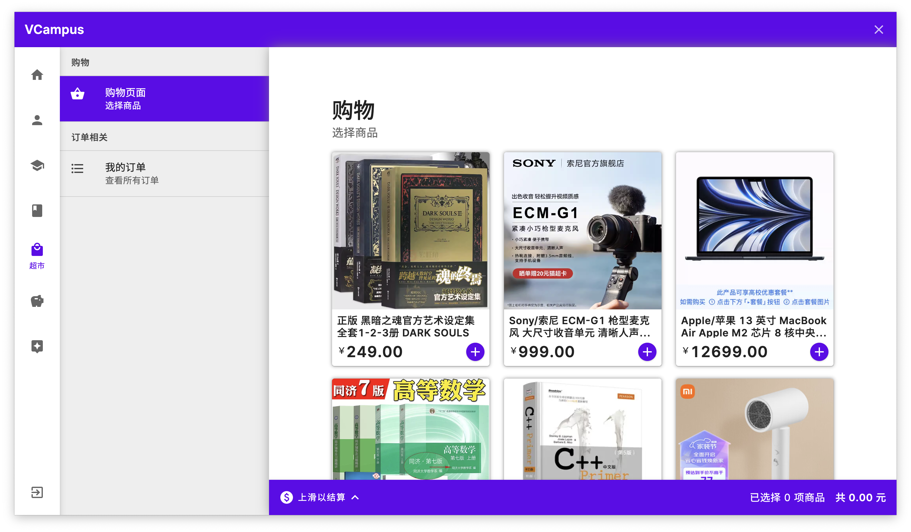
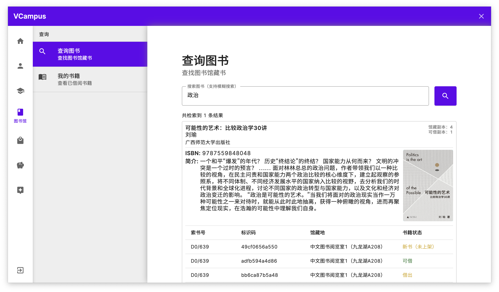
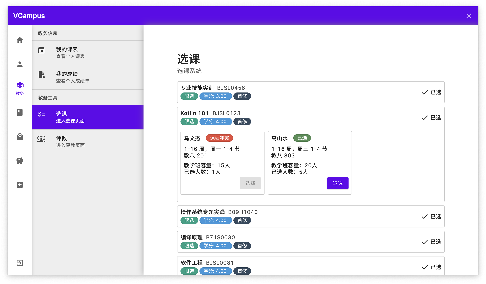

# SEU-SummerSchool-VCampus

本项目为东南大学 2021 级计算机科学与技术专业暑期学校专业技能实训项目 VCampus

本项目由以下 6 位本科生完成，欢迎访问他们的 GitHub 主页

[JinBridger](https://github.com/JinBridger),
[idawnlight](https://github.com/idawnlight),
[Dkiritoz7](https://github.com/Dkiritoz7),
[onetwogozz](https://github.com/onetwogozz),
[unolearner](https://github.com/unolearner),
[GreatSlove](https://github.com/GreatSlove)

## ✨ 快速开始

### Requirements

- `JDK >= 17`
- `MySQL >= 8.0.0`

### 启动方法

将 Release 中的服务器 SQL 部署至服务器/本机，同时在本机运行 server 与 client 的 JAR 文件即可

## 📃 其他说明

- 关于本项目的相关文档，请参见 `doc` 文件夹
- 本项目 Java Doc 文档已部署至 [GitHub Pages](https://jinbridger.github.io/SEU-SummerSchool-VCampus/)

## 📸 运行截图

